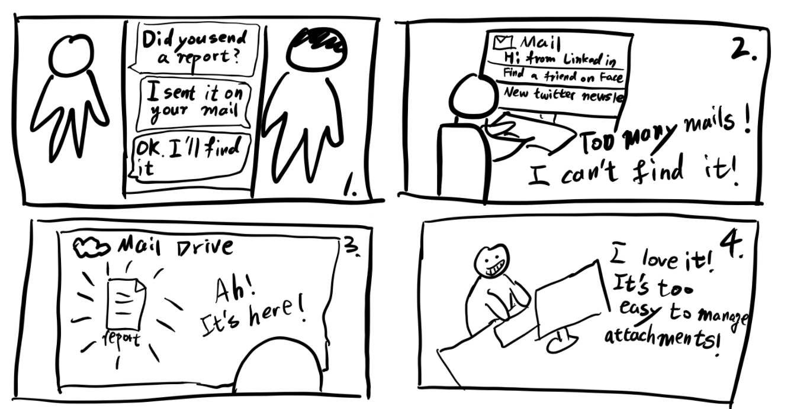
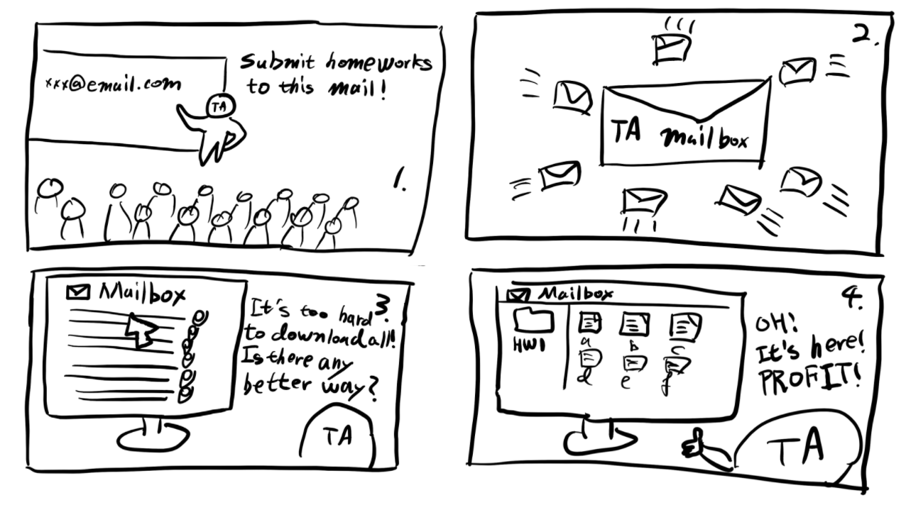
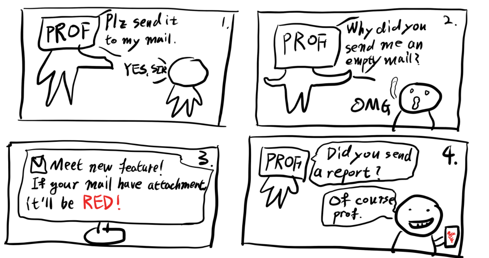

# CS374 - DP2
### Team NanoMario

## POV: Point Of View
Graduate Student needs to manage the documents received on E-mail because they are sharing many files with E-mail and it’s uncomfortable.
We met: Graduate Student in Multimedia computing lab
It’d be game-changing to: manage the documents received via E-mail
We were amazed to realize: they are sharing many files with E-mail

## Persona
다양한 채널을 통해 사람들과 자잘한 information (text, image, excel, documents, etc) 공유를 많이 함

1. demographic information such as name, occupation, age, and gender
    
    name | age | gender | occupation
    -- | -- | -- | -- 
    김공유 | 28 | male | Ph.D studnet in KAIST SoC

2. motivations

    I want to finish work quickly. I want to reduce the inefficiency like the useless time of finding a document.

3. beliefs
    * Work must be handled efficiently.
    * Respect the way the group prefers rather than personal preference.

4. preferences
    * Professor
    * Early off work
    * Efficient work
    * Hates the situation where things are delayed with minor mistakes

5. a story or a scenario that captures a task the persona has in mind, with surrounding context.

    I’m 28 years old, Ph.D student in KAIST SoC. A week ago, I had tried to send an email to professor, my research advisor, to share a paper. I personally like Dropbox and Google Drive, but I’m trying to use email as the most lab people, including the professor, are primarily communicating via email.
    However, I was annoyed because I could not get a reply from my professor for a week. When I checked my mail again, I realized that I sent the mail without attaching my paper. I think the mail-sharing system is really uncomfortable.
    One day, my colleague asked me to reshare the file that professor shared before, but I could not find it easily in the mailbox. So I inevitably asked the professor to resend the file again.

## HMW questions
1. HMW improve E-mail attaching document system?
2. HMW remove attachments from mail?
3. HMW do not use E-mail when sharing file?
4. HMW treat attachments of mails as typical files?
5. HMW should not make a file needed to be shared?
6. HMW directly share a document via email when it is saved?
7. HMW a lab leader take care of all file managements?
8. HMW treat a mail with/without attachment in different way?
9. HMW save attachments from the email automatically on the local computer, when the mail is received. 
10. HMW support deep search inside to attachments.

## Solution Ideas
1. HMW remove attachments from mail?
    1. create a cloud storage integrated to save attachments of email
    2. save files outside and share only link of the files?
    3. 파일을 업로드하면 외부 서비스로 연결한다
    4. 다른 서비스를 통해 문서를 공유하면 메일을 자동으로 보내준다
    5. 문서의 업로드하면 문서의 내용을 메일의 본문으로 발송한다
    6. 랩의 규모가 크지 않다면 구두로(오프라인으로) 문서를 공유하는 것은 어떨까

2. HMW treat attachments of mails as typical files?
    1. browse files like a folder
    2. Make several cloud folder for attached files, for each mail sharing team.
    3. make a folder of emails with something attached.
    4. automatically save the attached files at external file server and browse them.
    5. Filter mail with and without attached files.
    6. Automatically upload it on drive.
    7. 첨부된 파일의 이름이 불명확한 경우 파일의 이름을 바꿔준다.

3. HMW treat a mail with/without attachment in different way?
    1. Set different background color on editor if attachment exists or not
    2. Set different background color on mail-list if attachment exists or not
    3. Automatically group mail by file types
    4. Separate “Send a mail” and “Send file” button
    5. Filter mail with attachments with file name extension.
    6. Make thread for related files.(version control system for mail.)
    7. Add a tag or an image on the title of a mail, which represents attachments.
    8. When an attachment doesn’t exists, show an alert message to get confirm from the user.

## Top3 Solution
1. Create a cloud storage integrated to save attachments of email
2. Browse files attached to mail system like a folder
3. Set different background color on editor if attachment exists or not

## Storyboards
1. Create a cloud storage integrated to save attachments of email

2. Browse files attached to mail system like a folder

3. Set different background color on editor if attachment exists or not

