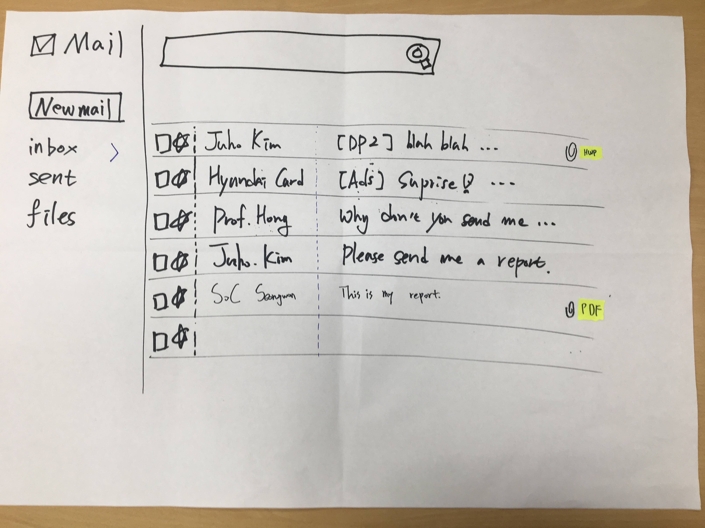
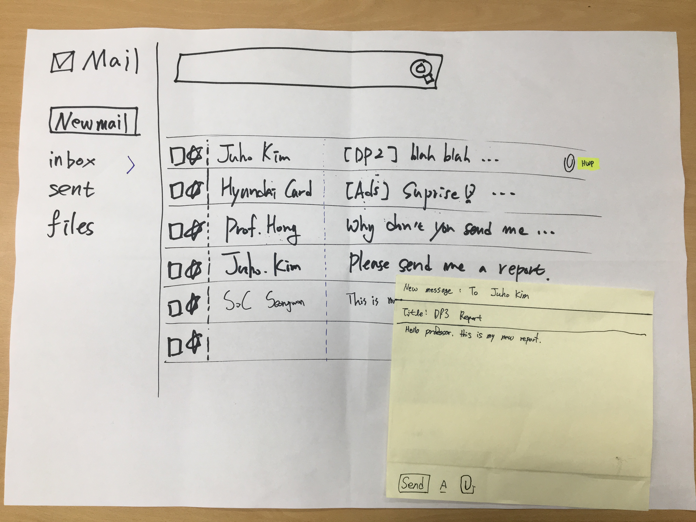
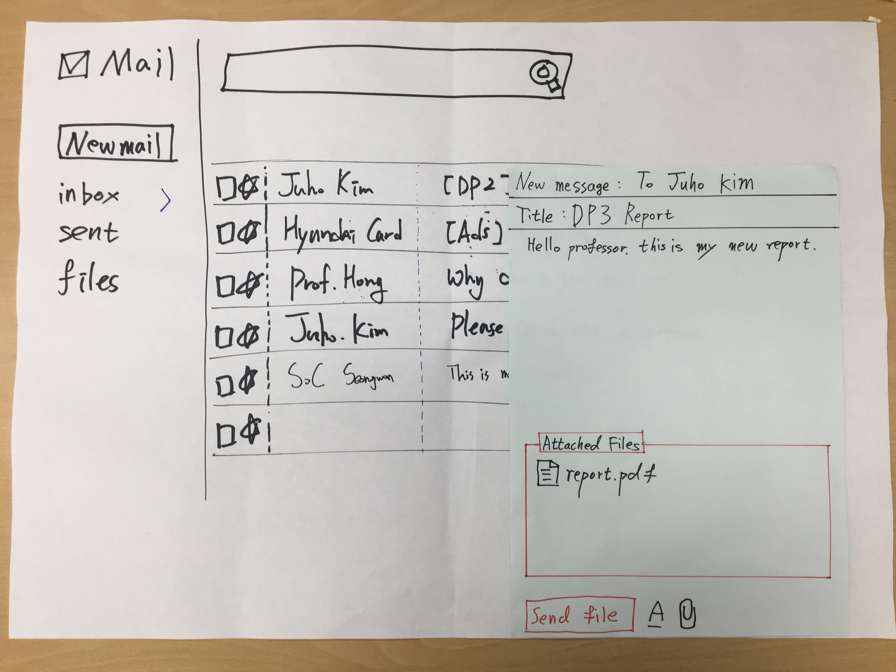
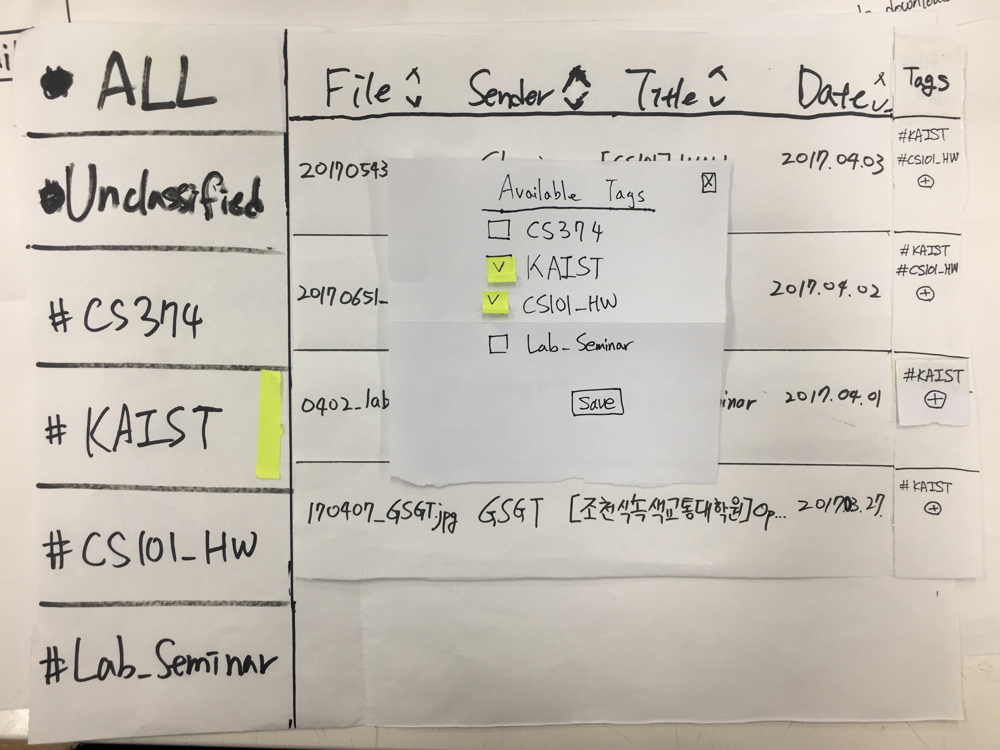

# CS374 - DP3
### Team NanoMario

## Photos of prototype

This is the initial view of our prototype.
 

Default mail send editor with yellow background color which appears when a user clicks `New Mail` button.

Mail send editor when a file is attached. The background color is changed to blue and `Send` button is changed to `Send file` with red color.

A view of attachment files which is filtered by tag #KAIST. When a user click `New Tag` button at left down corner, he/she can add a new tag.

The popup shows when a user clicks `+` button in tags column to attach/detach tags from the file.

## Briefing
We want to give a better way to manage attachments to people who share files with e-mail. Especially, this service is for graduate students who have to send/receive mail with attachment. So we are going to give a solution that can reduce mistakes in sending emails without attachments, and manage attachments easier with tagging.

## Tasks
1. Write a new mail to Prof. Juho Kim, attaching a report file. 
2. Find a list view of attached files, and check all attachments, and filter CS101_HW related file only.
3. Add a new tag named ‘Lab-Seminar’, and apply it to the ‘0402_lab.ppt’ file.

## Participant
Because target user group's age is similar to interviewer's, we were able to find people who have acquaintance. We interviewed them.
* P1: SoC Senior / Male / use gmail client
  * Have intent to go to graduate school.
  * Send email with attachment frequently.
* P2: 16’ EE Student / Female / use KAIST mail client
  * Have intent to go to graduate school.
  * Send email with attachment frequently.
* P3: 14’ SoC Student / Male / use gmail client
  * Have intent to go to graduate school.
  * Send email with attachment frequently.
* P4: 15' SoC Graduate Student / Male / use gmail client
  * Send email with attachment frequently with interviewee's lab mates.

## Observations
### 1. Write a new mail to Prof. Juho Kim, attaching a report file.
* [High] They didn’t recognize changing background color of mail client. People does not notice weather changing the color of paper is intended or not because of paper prototype. [P1, P2, P3, P4]
  * As there is no special sending mode on a mail client in a user model, they might be hard to recognize our intent. We are going to consider this learnability issue and add some element on mid-fi prototype and re-test it.
* [High] Most users didn't understand why it is related to `reducing mistakes in sending emails without attachments`. [P3, P4]
  * Our paper prototype might be work only if a user learned our features, changing color of background and a send button, and familiar with them. So we are going to consider a new task to test preventing the lapse error properly on low-fi prototype.  
* [Mid] Hard to distinguish `send` button and  `send file` button. [P1, P2, P3, P4]
  * We are going to change a color of button background, not a text color, and test it on Low-fi prototype.

### 2. Find a list view of attached files, check all attachments, and filter CS101_HW related file only.
* [High] The user who cannot intuitively understand our new feature, doesn’t have a proper mind model. She hesitates how and what to do. After facilitator explained more, she understands our ideas and reacts as our intention.[P2]
  * We're going to provide a simple tutorial about our new feature on the first time and test it on Mid-fi prototype.
* [Mid] The reactions was different between who can and cannot intuitively understand the new feature “files list” (i.e. who has / has not a user model of `files list` feature). [P2, P3]
  * We're going to advance briefing and task descriptions more detail.
* [Mid] Some people was confused becuase he/she didn't recognize '#CS101_HW' was already exist. [P2, P4]
  * We're going to sort tags as alphanumeric order in tag lists for user to easily find it in Low-fi prototype.
* [Low] A user, not familiar with hashtag concept, understands a tag as a directory because of layout. [P3]
  * We think that a user could understand the concept if he adds and uses his own tag at once. So we're going to test weather a user would understatnd the `tag` concept properly using our system on mid-fi or hi-fi prototype. 

### 3. Add a new tag named ‘Lab-Seminar’, and apply it to the ‘0402_lab.ppt’ file.
* [High] Because colors didn't exist between elements, a user couldn't recognize which is a button or a text.[P3, P4]
  * As this is a paper prototype, affordance of each element might be weak. So, to distinguish a button or a text on their purpose, we're going to add some colors and proper shapes on buttons, and other elements, in low-fi prototype.
* [Mid] Because `Add new tag` button is at the bottom of tag list, it took long time to find it. [P1, P4]
  * On low-fi prototype, `Add new tag` button will be on the top of the list or proper position after doing a simple survey on target users. 
* [Low] Needs searching tag feature. He was confused because there wasn't searching feature on tag lists. [P4]
  * It will be added on mid-fi prototype. Before that, we should consider about a proper position of a search bar and it will be added on low-fi prototype. 

## Individual Reflections
### Rohjoon Myung (20090336)

#### What role did you play in each round?
Facilitator

#### What were some of the difficulties you faced playing the role(s)?
Sometimes, people didn’t understand about the task or the question. I had explained about confused one, and lead the test, but I was wonder I was good or not. After reading the reading-material about user testing, I’d reviewed what I was doing, and found that it was a bit hard for me to telling interviewer saying what they’re thinking and what they are going to do.  

#### In what way was paper prototyping useful in your project?
We could consider about the real UI interface in advance. And we could check the feasibility of it by experiecing it.  

#### What did your paper prototype not cover or test?
One of problems our solution should handle is `a mail with missing attachment`.  We were trying to reduce a lapse of sending email without attachment, and made some solutions. But as one of the best solution we had discussed detects the lapse  through a body of the email, it might be hard to test it through a paper prototype. So, we planed to test it on mid-fi prototype or hi-fi prototype.

### Changje Jeong (20110846)
#### What role did you play in each round?
Computer

#### What were some of the difficulties you faced playing the role(s)?
At the first operating was very busy and difficult. It's hard to prepare and predict other scenes or components properly. Because I've already known our prototypes' steps, I prepared next steps in my mind. However, when a user failed to follow our expectation and interact with wrong component, it was hard to keep quiet and I wanted to guide a user which is not a computer's role. At the last, computer was so busy to observe user.

#### In what way was paper prototyping useful in your project?
It was good chance to find out our low fidelity UI layout. We have found out a lot of layout problems. And also, users gave us some constructive feedback very well. Most comments were pointing out the flaws, but some were compliments of our prototype.  

#### What did your paper prototype not cover or test?
We didn't test multi-level tag which support hierarchy of tags. Altough we had test for writing a new mail with attachment, it doesn't give strict confirmation about it can help not to forget attach a file to an  e-mail. About attachment tagging feature, we didn't test automatic tagging, which tags mail attachment by predefined condition. Instead, we tested usability of tagged list of attachments.

### Seongwon Lee (20150556)

#### What role did you play in each round?
There were 4 interview round. I played observer for first 2 round, and computer for last 2 round.

#### What were some of the difficulties you faced playing the role(s)?
When I play observer, I have to conscious of people's gaze and find out what they consider, why they concern about their action. Searching and finding informations from it was important but complicated.
When I play computer, there were some elements that should be active after click another element. Because it can confuse user if I don't present in well order, I always concentrate on my work.

#### In what way was paper prototyping useful in your project?
We was able to built basic layout for our solution. And, we considered carefully how we implement our task - ex) classify attached files in tag, or directory - and what problems can be occured in our implementation. Paper prototype enabled to test our implementations in really low-cost.

#### What did your paper prototype not cover or test?
In this prototype, we didn't implemented some features like subtag, tag in tag, because we thought it don't have to be impelented in paper prototype. But we got a question related to subtag from studio. Maybe, covering more features could be better. And our solution is based on mail system and mail system has its own many features. But we didn't covered it.

### SeungMin Lee (20150566)

#### What role did you play in each round?
I participated in all 4 interviews, and I was an observer for all 4 interviews.

####	What were some of the difficulties you faced playing the role(s)?
Observing each interviewers’ actions, such as hesitancy, was more difficult than I thought, and because observer should be quiet, I was frustrated when some interviewers were confused and hesitant.  
It was quite difficult to take copious notes because each interviewers have different degree of understanding the prototype and performing the task depending on their characteristics.  
Some of interviewers were expert to our new features although they watch it for the first time, so there were not much to observe from their interviews.

#### In what way was paper prototyping useful in your project?
We can test our prototype with low cost and effort, and can get immediate responses and feedbacks from interviewers.

#### What did your paper prototype not cover or test?
Because it’s paper prototype, there was limitations at representing UI such as giving specific color difference or making buttons look like button shapes.  
As like searching e-mails by keywords or names, our project should add and implement searching features on attached files and file tags. It was really hard and complex to make searching features on paper prototype, so we did not cover it on paper prototype.  

## Studio Reflections
1. (Students) `Tagging a file` is really good feature. But sometimes, a user might want to filter files of #CS_HW1 or all of #HW. How did you distinguish files like that?  
There will be a parent group and child group, which could be devided by `/`. In this case, if the file should have a tag `#HW/CS_HW1`, then you could filter them as you want. 
 
 2. (TA) There should be a more active feedback to user like toasting a notice popup for an error of missing an attachment by analyzing a title or a body of the email weather it should contain an attachment or not.  
It's really good point. We're going to apply the 'active' feedback on mid-fi prototype as there might be some automated funtionality.  

