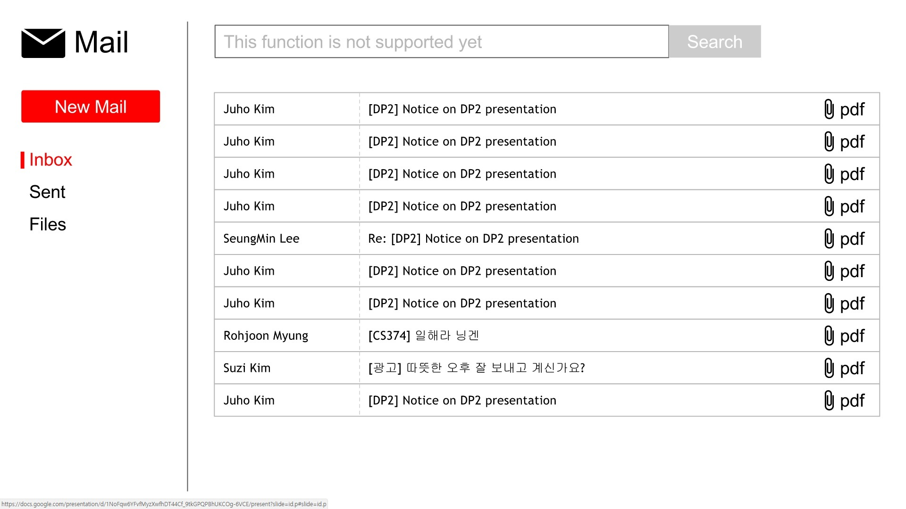
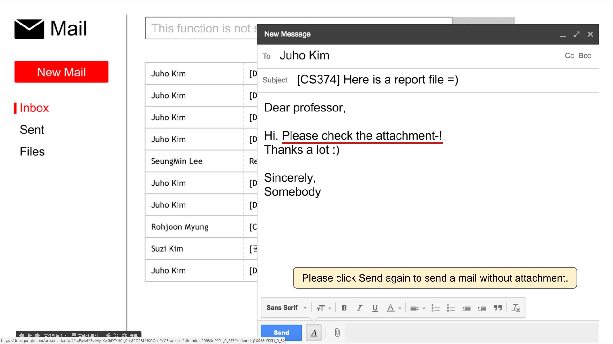
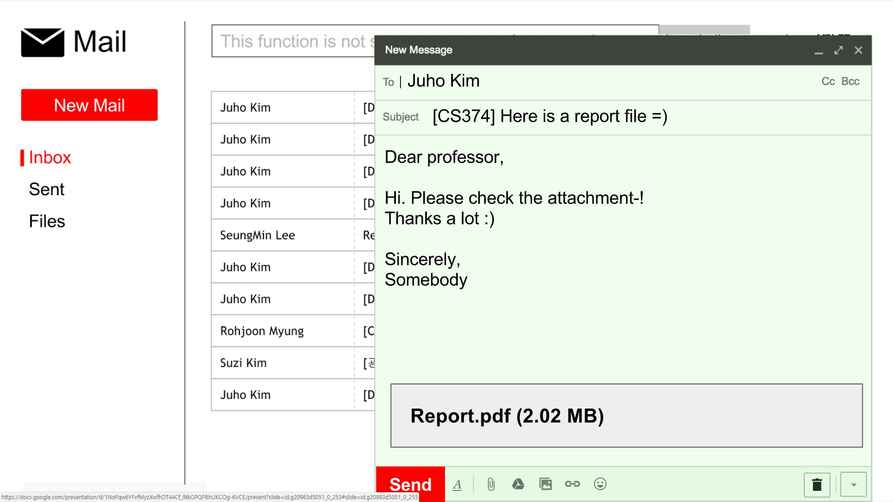
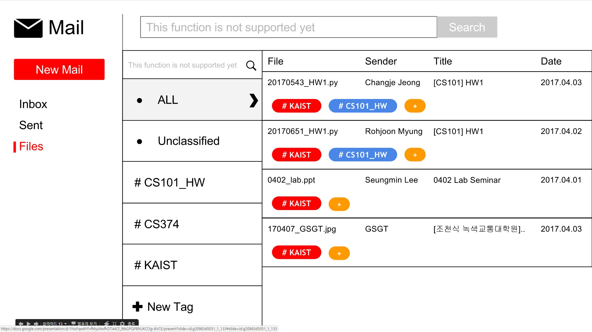
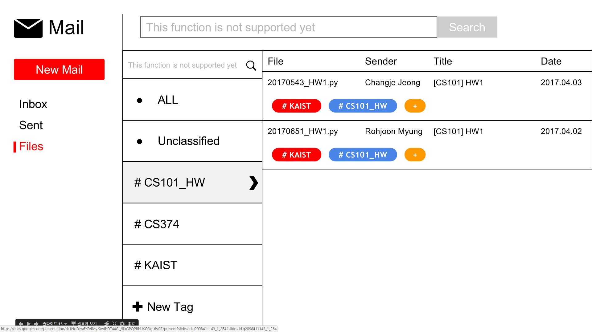
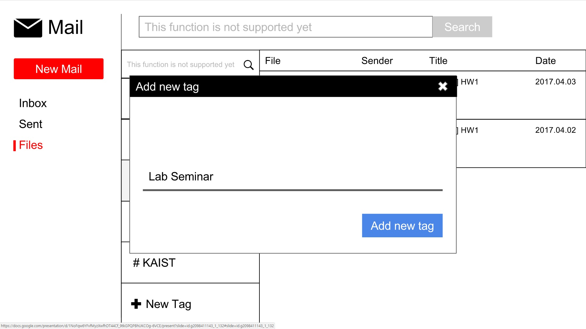
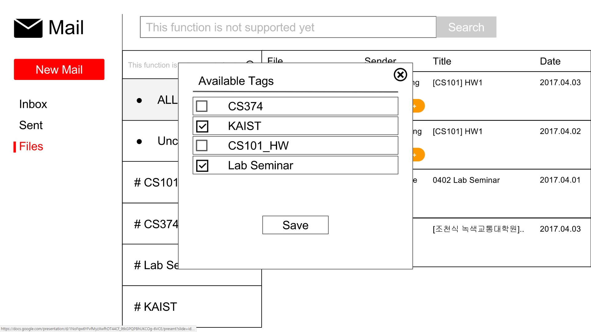

# CS374 - DP4
### Team NanoMario

## POV
Graduate Student needs to manage the documents received on E-mail because they are sharing many files with E-mail and it’s uncomfortable.

## Tasks
1. Write a new mail to Prof. Juho Kim, attaching a report file.
2. Find a list view of attached files, and check all attachments, and filter CS101_HW related file only.
3. Add a new tag named ‘Lab-Seminar’, and apply it to the ‘0402_lab.ppt’ file.

## Prototype
### Prototyping tool
Google Slides 

### Design choices

### Representative screenshots

### Instructions

## Observations
### Participants
- P1: M.S. student in School of Electrical Engineering / Male / using gmail / Working as TA
- P2: M.S. student in Department of Chemical and Biomolecular Engineering / Male / using kaist mail / Working as TA
- P3: M.S. student in Department of Chemical and Biomolecular Engineering / Male / using kaist mail / Do not work as TA
- P4: Ph.D. 1st grade / Male / using gmail / Working as TA

### Usability problems (Observations)
1.
2.
3.
4.
5.
6.
7.
8.
9.
10.

## Paper vs Digital
### 1. types of usability issues they helped identify

### 2. participants' reaction and expectation to prototypes

### 3. summarize what changes you made in the digital prototype based on the feedback from your paper prototyping testing

## Studio Reflections
1. (TA) + Your prototype is very similar to Google email UI, which is easy to use when they experienced.
- However, since your project is focused on attaching file problems in an email system, I wish that the attaching symbol is too small when we sending the email. Also, I think your team should consider that how to show multiple files in a single email. Also, the list form for showing attached files may not useful in case of many attached files. 

2. (Students) 

