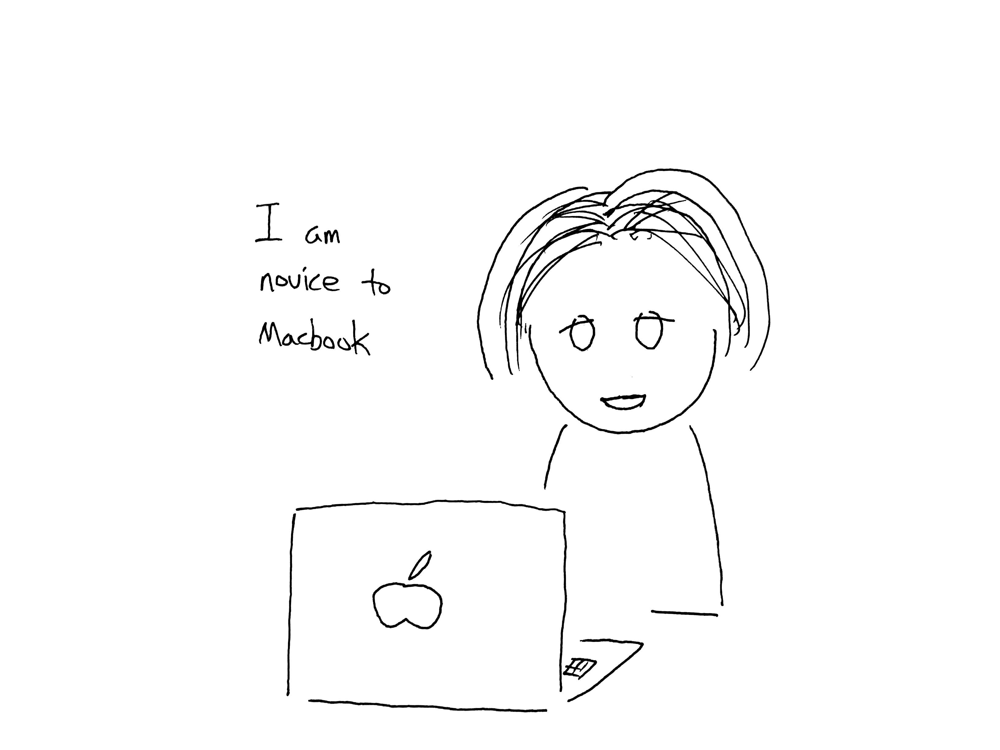
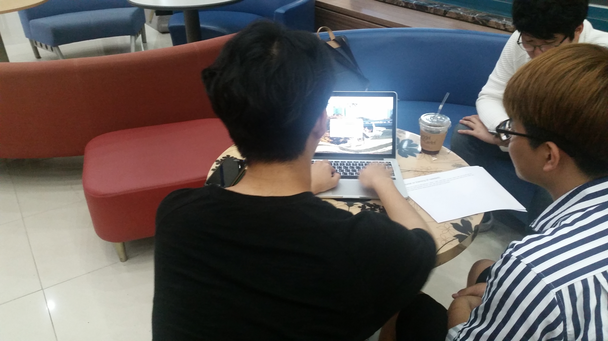
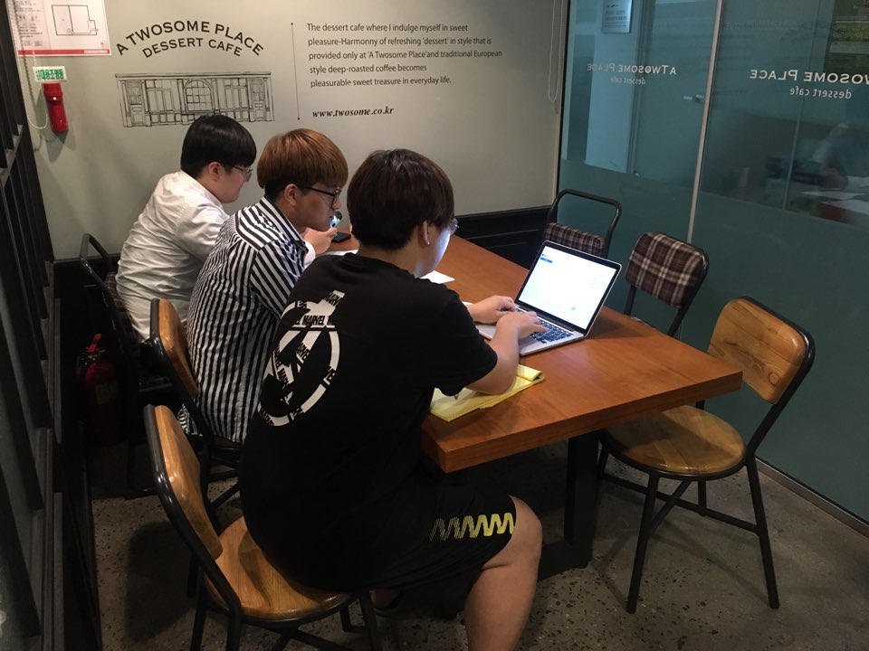
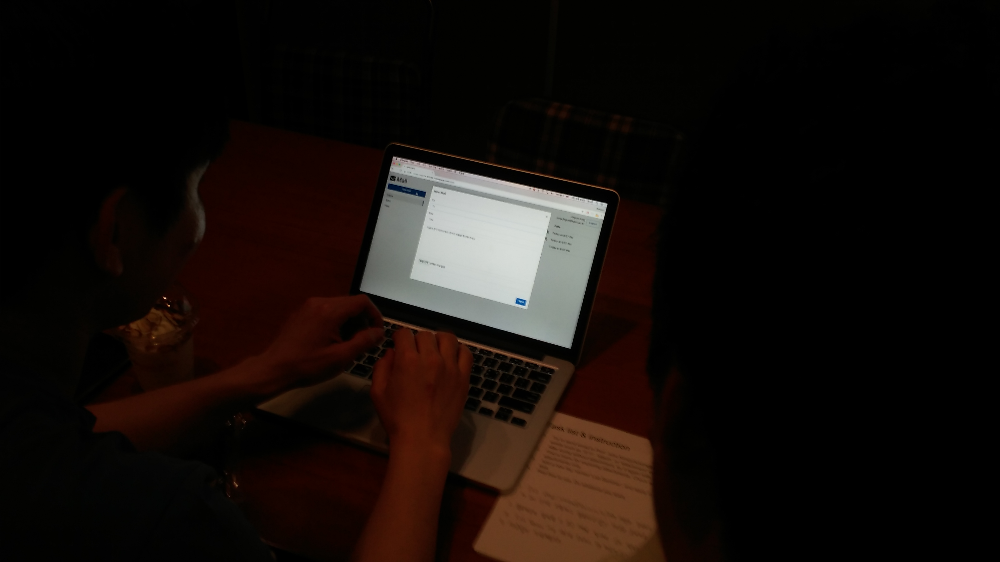

# CS374 - DP7
### Team NanoMario

# Planning: Written protocol

We described our protocol in English on report, but our participants were all Korean, so we explained protocol in Korean language to participants. We tried hard to convey the same content as English. 

## Instructions for preparation and setting up the testing environment
Valid website URL: https://cs374-32b99.firebaseapp.com

Team should prepare:
- The MacBook Pro (Retina, 13-inch, Mid 2014)
  - For recording screen and voice. Use `QuickTime Player`.
- Camera or smartphone to take a picture.
- Team should open website with chrome before starting a test.

## Introduction and informed consent
### Introduction
  We want to give a better way to manage attachments to people who share files with e-mail. Especially, this service is for graduate students who have to send/receive mail with attachment. They have some difficulties in handling many mail’s attachment at once. So we are going to give a solution which can help to reduce mistakes in sending emails without attachments, and manage attachments easier with tagging.
  
  When you start test, you can login with mail what you use in first page. But it is not a mail system that really works, so it won’t show mail what you sent in real mail system, or really send mail even you click ‘Send Mail’ button on our system. So, feel free to use our system. When you login our system, you can see three components on our left sidebar.
 
### Informed consent
  1. We are going to record the video of the computer screen and the audio using computer mic while you are using our service.
  2. We might take pictures at the back of you while using our service, but it WILL NOT INCLUDE any personal information of you.
  3. We are going to give some questions during and after the testing and we’ll write down the answers.
  4. Keep in mind that we’re testing the computer system. We’re not testing you.
  5. The system is likely to have problems in it that make it hard to use. We need your help to find those problems.
  6. Your test results will be completely confidential.
  7. You can stop the test and leave at any time.
  8. If you have any questions before we begin, please ask us.

## Tutorial or training
  > Because our system is similar with existing mail system, we may not need a tutorial. But if a user don’t understand what is going on, then we are going to explain the system detail less than 1 minute.

  There are 3 tabs on left side bar, `inbox`, `sent`, and `files`. On the `inbox` tab, you could see all mails you had received. On the `sent` tab, you could see mails you had sent. And on the `files` tab, you could see all the attachments which are sent or received. 

## Task list & instruction:
  > We don’t need instruction because our system is similar with existing mail system, and we already give sufficient information about how to use our system on tutorial part.

  1. Try to send email to Prof. Juho Kim(juhokim@kaist.ac.kr) without attachment. Please include words such as '첨부', 'attach', or 'attachment' in mail body. 
  2. After trying without attachment, try it again with attachment.
  3. Find a menu for exploring attachments. Check all attachments, and find CS101_HW1 related attachments only.
  4. Add a new tag named ‘Lab Seminar’, and apply it to the file that you have sent on the first task. 
  5. Feel free to use. Do whatever you want.

## Recording strategy
  We’re going to record the screen by Mac’s `QuickTime Player`, which could record the screen and the voice at the same time. 

## Questionnaires, Interview questions
  1. What do you think of the error message when an attachment is not on the mail sending a mail.
  2. What do you think of the ‘clip’ icon? What reminds you? Do you recognize it? 
  3. Is there any unnatural or unusual features?

## Debrief prompt:
  First, we should give a participant a great thank with smile.
  Our project is to help graduate students deal with attachments more efficiently, one of the grievances of using email.
  Thanks to you, I think we can improve our system in a better way.
  Thank you for your precious time. (Finishing greetings, freely)

# Session observations
  > We took pictures of each participant on their back when they are experiencing our system. However as we didn’t make any protocol to take a picture except for taking him/her on their back, the quality of the picture is extremely not consistent. Please understand.

## P1
### Participant information
  

* Who? 
  - Graduate school student of Civil & Environmental Engineering Department
  - Mainly using KAIST Mail
  - Never have TA experience

* How did you recruit?
  - Friend of Seongwon Lee

* Why does she represent target users? 
  - Because she is a graduate student.

### Summary of session
  - She successfully finished Task 1 and she said it is helpful feature.
  - She didn't understand what "Hidden" is meaning.
  - During task 3, she tried to add a file on an empty tag-filtered page("Lab Seminar" page) which is created by a user.
  - She had difficulty to use macOS especially switching Korean <-> English.
  
## P2
### Participant information
  

* Who? 
  - Graduate school student of Mechanical Engineering Department
  - Mainly using Gmail. Forwarding KAIST Mail to Gmail.
  - Never have TA experience

* How did you recruit?
  - Friend of SeungMin Lee

* Why does he she represent target users? 
  - Because he is a graduate student.

### Summary of session
  - He successfully finished Task 1.
  - He tried to add a new tag on ‘drop down menu of selecting a new tag’ on each file cards.
  - He had difficulty to use macOS especially changing Korean <-> English.

## P3
### Participant information
  

* Who? 
  - Graduate school student of Materials Science and Engineering Department
  - Mainly using KAIST Mail
  - Never have TA experience

* How did you recruit?
  - Friend of SeungMin Lee

* Why does he represent target users? 
  - Because he is a graduate student.

### Summary of session
  - He successfully finished Task 1 and Task 2.
  - He said he was confused on Task 3 because he misunderstood the task.
  - He had difficulty to use macOS especially changing Korean <-> English.

## P4
### Participant information
  

* Who? 
  - Graduate school student of Electrical Engineering Department
  - Mainly using GMail
  - Never have TA experience

* How did you recruit?
  - Friend of Seongwon Lee

* Why does he represent target users? 
  - Because he is a graduate student.

### Summary of session
  - He successfully finished Task 1 and Task 2.
  - He visited to "Lab Seminar" tab before going to "All".
  - During task 3, he tried to add a file on an empty tag-filtered page("Lab Seminar" pag) which is created by a user.
  - He expects to download the file by clicking the file-card, but it shows the preview on a new tab

## P5
### Participant information
  

* Who? 
  - Graduate school student of Computer Science Department
  - Ph.D candidate at [KAIST HCI Lab](http://hcil.kaist.ac.kr/)
  - Mainly using GMail
  - He has many TA experiences. He is working as CS206 Data Structure TA.

* How did you recruit?
  - Friend of Changje Jeong, Rohjoon Myung

* Why does he represent target users? 
  - Because he is a graduate student.

### Summary of session
  - He successfully finished Task 1 and Task 2.
  - He didn't understand what "Hidden" is meaning.
  - He tried to add a new tag on ‘drop down menu of selecting a new tag’ on each file cards.
  - He found the file is disappeared after adding first tag on a file if the file view is filtered by `unclassified` and it makes hard to add second tag.
  - He wanted to create a new tag on sent / inbox mail view.

# Usability issue
1. When there is no file on a new tag, which is created by a user, some people try to add a file on an empty tag-filtered page. (P1, P4)
* High
* We thought that this usability problem happened as a user were confused concepts between `folder` and `tag`. So, we're going to emphasize the `tag` functionality by adding `#` symbol, and so on, and re-test it.

2. Many people did not understand what `hidden` button represents. (P1, P5)
* High
* We thought the word `hidden` is not appropriate. Actually, the functionality of `hidden` is exactly same as `archive` in mail system, and the name `archive` is much affordable. So, we're going to rename `hidden` to `archive`.  

3. Many people try to add a new tag by typing on ‘drop down menu of selecting a new tag’ on each file cards. (P2, P5)
* High
* To improve usability, we have to add a new tag button or any functionality adding a new tag on the dropdown menu of showing tags.

4. When people sent a new mail with a file, most people have had trouble finding the file they sent. (P3, P5)
* High
* First, We are going to add a link to the sent mail at the toast("Your mail has been sent").
* On the other hand, we thought the list of tags is not properly composed. Some users got in trouble to find a button to click to find a file at the files page during Task 3. So we'll recompose the default buttons (e.g. 'Add', 'Unclassified'), and other user-created tags.  

5. We cannot create a new tag on sent / inbox mail view. (P5)
* High
* Through the solution of #3, we could solve the problem #5 at the same time.

6. There is no way to add a tag when writing or sending a mail. (P4, P5)
* High
* We are going to create a functionality of adding a tag when sending a new mail.

7. Some people want to see the number of files each tag holds. (P1)
* Mid
* We thought this is not critical but if it does, it might be good for usability, so we might implement it.

8. Most people expect to download the file by clicking the file-card, but it shows the preview on a new tab (P3, P4)
* Low
* It was a browser issue, and we thought it is not a big deal. To solve this problem, we should add some code for a browser not to show a preview of the file. We're going to implement this if we got some time. 

9. Some people want to `star` to the important files. (P1)
* Low
* We thought it is not important to verify our main feature, managing a file with tags. But most people are familiar with 'archiving and starring email', we realize they afford to do it on the file list. So, if we have some more time after the iteration, we're going to implement this for the first time. 

10. When adding 2 tags on a single file at the same time, if the file view is filtered by `unclassified`, the file is disappeared right after a new tag is added to it. (P5)
* Low
* It might be great if we delay the update and queuing the user action, and execute them at once! But the time cost to implement this might be so high that we're not going to solve this right now. If we have some more time after the iteration, then we're going to consider this to implement or not.
 
 

## High-level reflections: 
 <!--High-level reflections are thoughtful and insightful? -->
1. What did you overall learn from the user testing experience?
- There were a lot of exceptions when testing the system. Users' actions were always different from our expectations. 
- 

2. What would you do differently for better results and insights?
- 

# Studio Reflections

> Asking about privacy was good. it should be reflected to all user test, too.

We stated our informed consent to every participants, and we carefully considered their privacy and other human rights.

> Task includes research about how to manage files, but there is no questions about it.

It was quite difficult to prepare task specific questions because every use might behaved differently. So, without making questions in advance, we wanted to get a deeper understanding of the user's actions and our task progression by asking directly when the user did something unique.

> Will your team use think aloud strategy?

We recorded sound but it was not for think aloud strategy but for understanding context of recorded screen. So we didn't use it.

# Plan for iteration
## Goal
1. We would solve the high and mid usability issues.
2. We sould verify our solutions by running another user tests. 
3. There would be no bugs and functionalities not intended by us.

## Plan
1. First, we are going to implement solutions to resolve high and mid usability issues discovered on the user test, which is explained on `Usability issue` part, until June 8th.
2. After that, we are going to run another user tests until June 10th, to clarify whether our usability issues were solved or not. 
3. Before the final presentation, we are going to fix bugs and other critical usability issues discovered on the iteration #1 and #2 (which are written above). 
4. If we have some more time before the final presentation, we would solve low usability issues. 

<!--You'll have an additional week to finalize your overall design process. Discuss in your team how to use this time most effectively, and make a few concrete goals. Justify your goals.-->
